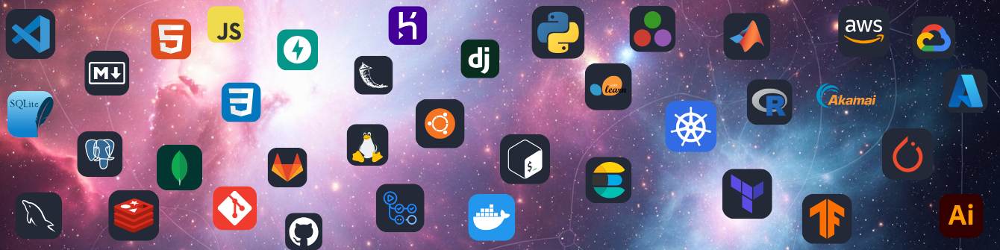

<h1 style="color:white; font-family: 'Optima'; font-size:28px">
  A Curious Mind in the Infinite Data Universe
</h1>

  

<!--&nbsp;--->
<h2> That's me, 
<a href="https://beenlanced.github.io">Lance Hester</a> 
</h2>
I'm a data scientist, innovator, and researcher who enjoys cooking up data magic with all my favorite frameworks and libraries to solve business and research problems.

&nbsp;

## You can find me around the web 🌎:

- Connecting with folks on 

- Submitting inventions to the 

- Writing blogs posts on 

&nbsp;

<h2 style="color:white; font-family: 'Optima'">
  If you're curious, my particular set of skills include:
</h2>

- `Agile/Scaled Agile FramEwork (SAFe)/SCRUM:` JIRA, Project Management, Scrum Master/Engineer

- `Artificial Intelligence (AI) Frameworks:` Hugging Face, Keras, Langchain, PyTorch (Lightning), TensorFlow

- `Cloud Platforms:` Akamai/Linode, AWS, `Azure, GCP`

- `Collaborative Software:` Atlassian (Confluence), Google Docs, Microsoft 360, Miro, Slack

- `CyberSecurity:` Distributed Denial of Service (DDoS) (Flow Based Monitoring (FBM) - NetFlow, sFlow )

- `Data Engineering:` Elasticsearch, Redis, SQL(MySQL, PostgreSQL, Snowflake)

- `Deep Learning (DL):` Convolutional Neural Networks (CNNs), Generative Adversarial Networks, (GANs), Latent Space, Long Short-Term memory (LSTM), Recurrent Neural Networks (RNNs), Transformers

- `Development Operations (DevOps):` Coverage, Continuous Integration/ Continuous Deployment (CI/CD), Julia Testing, Linux, Pytest, Ruff, uv

- `Generative AI:` Fine Tuning (LoRA Adapters), Large Language Models (LLM), Retrieval Augmented Generation (RAG)

- `Machine Learning (ML) / Data Science:` Anomaly Detection of Time Series Data, Classification, Clustering (DBSCAN, K-means, K-nearest neighbors), Data Sampling, Dimensionality Reduction (`Latent Spaces`, `Linear Discriminant Analysis` (LDA) Principal Component Analysis (PCA)), Exploratory Data Analysis, Linear Regression, Natural Language Processing (NLP), Quantile Regression, Random Forests, Sentiment Analysis, Time Series Analysis, Tuning, XGBoost

- `ML Frameworks:` Flux.jl, Matplotlib, Numpy, Pandas, Seaborn, Scikit-learn

- `ML Operations (MLOps):` Docker, Kubernetes

- `Programming Languages:` Julia, MATLAB, Python, R

- `Statistics:` Correlations (Auto, Cross, Kendall, Pearson, Spearman), Hypothesis Testing, Interquartile Range (IQR and Modified IQR) analysis, `Propensity Modeling`

- `Version Control:` git, Github, Gitlab

- `Web Analysis:` Real User Monitoring (RUM) - mPulse

- `Web Frameworks:` FastAPI, Flask, Genie.jl

- `Wireless Sensor Networks:` IEEE 802.15.4, Internet of Things (IoT), SmartGrid, ZigBee Networks

 

<h2 style="color:white; font-family: 'Optima'"> 
  Get to know my some of my work, view my GitHub projects portfolio
</h2>

My public, open source projects can be found in these repositories. Give a project a star (⭐) if you liked it or if it was instructional for you!

&nbsp;

| Project Name                                                                                                                                                         | Main Libraries/Tools                                                                                                                                          | Cloud Service |   App   | DevOps Best Practices                                                                                                                                                                |
| -------------------------------------------------------------------------------------------------------------------------------------------------------------------- | ------------------------------------------------------------------------------------------------------------------------------------------------------------- | :-----------: | :-----: | ------------------------------------------------------------------------------------------------------------------------------------------------------------------------------------ |
| **Artificial Intelligence (AI)**                                                                                                                                     |
| [Semantic Search Application (end-to-end)](https://github.com/beenlanced/python_project_semantic_search)                                                      | AWS-ECS Docker FastAPI Github HTML Hugging Face Jupyter NLP Pytest Python Ruff Scikit-learn uv YouTube API                                                                                                            |     AWS          |  FastAPI  | Cloud Computing CI/CD (Github Actions) Containerization Data Validation Error Handling Linting Model Registry Model/Data Monitoring Data Validation Type Hinting |
| [Visualizing Latent Spaces](https://github.com/beenlanced/ai_learning_visualizing_latent_spaces)                                                      | Github Jupyter Keras Matplotlib MNIST Numpy Python Scikit-learn TensorFlow                                                                                                            |               |    | Learning Module for Review |
| **Data Analysis**                                                                                                                                                    |
| [COVID Social Distancing - Why the 10 Person Rule Mattered so Much](https://github.com/beenlanced/julia_learning_covid_10_people_rule)                               | Calculus Github Julia Jupyter Matplotlib Statistics Visual Studio Code                                                                      |               |         | Learning Module for Technical Presentation                                                                                                                                           |
| [Time Series Cross Correlations](https://github.com/beenlanced/stats_learning_timeseries_cross_correlation)                                                          | Github Julia Jupyter Matplotlib Statistics Visual Studio Code                                                                                  |               |         | Learning Module for Technical Presentation                                                                                                                                           |
| [Law & Order Cambridge - Exploratory Data Analysis (EDA) of Cambridge, MA Crime Statistics](https://github.com/beenlanced/r_eda_cambridge_ma_crime_stats)            | Github EDA Markdown R R-Markdown R-Studio Statistics                                                                               |               |         | Learning Module for Technical Presentation                                                                                                                                           |
| **Data Engineering**                                                                                                                                                 |
| **Dev/DevOps**                                                                                                                                                       |
| [UV Flask Web Application Demo (end-to-end)](https://github.com/beenlanced/python_project_uv_flask_webapp_demo)                                                      | Docker Github Pytest Python Ruff uv                                                                                                            |               |  Flask  | CI/CD (Github Actions) Containerization Data Validation Error Handling Linting  Logging Model Registry Model/Data Monitoring Data Validation Type Hinting |
| [Introduction to MetaProgramming](https://github.com/beenlanced/julia_learning_metaprogramming)                                                                      | Github Julia Jupyter Visual Studio Code                                                                                                              |               |         | Learning Module for Technical Presentation                                                                                                                                           |
| [Introduction2Julia - A Series of Julia Coded Notebooks Introducing the Julia Programming Language](https://github.com/beenlanced/julia_presentation_intro2julia)    | Github Julia Jupyter Visual Studio Code                                                                                                              |               |         | Learning Module for Technical Presentation                                                                                                                                           |
| **Machine Learning (ML) / ML Operations (MLOps)**                                                                                                                    |
| [Binary Classifier - Predicting Deaths on the Titanic](https://github.com/beenlanced/binary_classifer_predicting_titanic_deaths)                                                    | AUC Confusion Matrix EDA Github GridSearchCV Jupyter Logistic Matplotlib Numpy Pandas Python ROC Seaborn Scikit-learn Statistics uv Visual Studio Code |               |  | Learning Module for Technical Presentation                                                                                                                                           |
| [Time Series XGBoost Forecasting Megawatt Hour Usage Application (end-to-end)](https://github.com/beenlanced/ts_forecasting_project_dominion_energy_mw)                                                      | AWS-ECS Cross Validation Docker EDA FastAPI Github HTML Jupyter Matplotlib NumPy Pandas Pytest Python Ruff Scikit-learn Time Series uv YAML                                                                                                            |     AWS          |  FastAPI  | Cloud Computing CI/CD (Github Actions) Containerization Data Validation Error Handling Linting Model Registry Model/Data Monitoring Data Validation Type Hinting |
| [Regression Analysis Car MPG Project: Linear and Quantile Regressions in Julia Programming](https://github.com/beenlanced/ml_project_car_mpg_prediction_regressions) | Github Julia Jupyter Matplotlib R Scikit-learn Statistics Visual Studio Code                                                             |               |         | Learning Module for Technical Presentation                                                                                                                                           |
| [Julia ML Project to Production Programming](https://github.com/beenlanced/julia_learning_ml_model_to_production)                                                    | Bash Shell Docker Github HTML Julia Jupyter Linux Matplotlib Scikit-learn Statistics Ubuntu Visual Studio Code |               | Gene.jl | Learning Module for Technical Presentation                                                                                                                                           |
| **Miscellaneous**                                                                                                                                                    |
| [Review of Python Classes and Instances Essentially Object Oriented Python (OOP)](https://github.com/beenlanced/python_learning_oop_refresher)                               | Github Jupyter Python uv Visual Studio Code |               |         | Learning Module for Practice/Review                    |

 

<h2 style="color:green; font-family: 'Optima'"> 
  Thanks for Visiting!
</h2>

You've `beenlanced`! 😉

<!--
**beenlanced/beenlanced** is a ✨ _special_ ✨ repository because its `README.md` (this file) appears on your GitHub profile.

Here are some ideas to get you started:

- 🔭 I’m currently working on ...
- 🌱 I’m currently learning ...
- 👯 I’m looking to collaborate on ...
- 🤔 I’m looking for help with ...
- 💬 Ask me about ...
- 📫 How to reach me: ...
- 😄 Pronouns: ...
- ⚡ Fun fact: ...
-->
